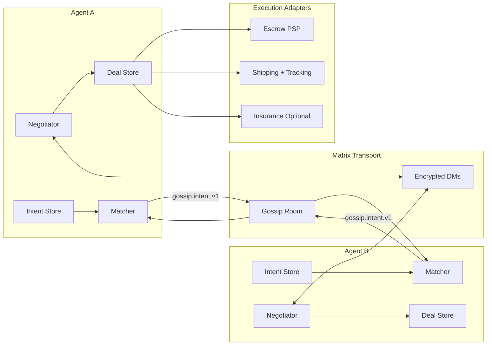
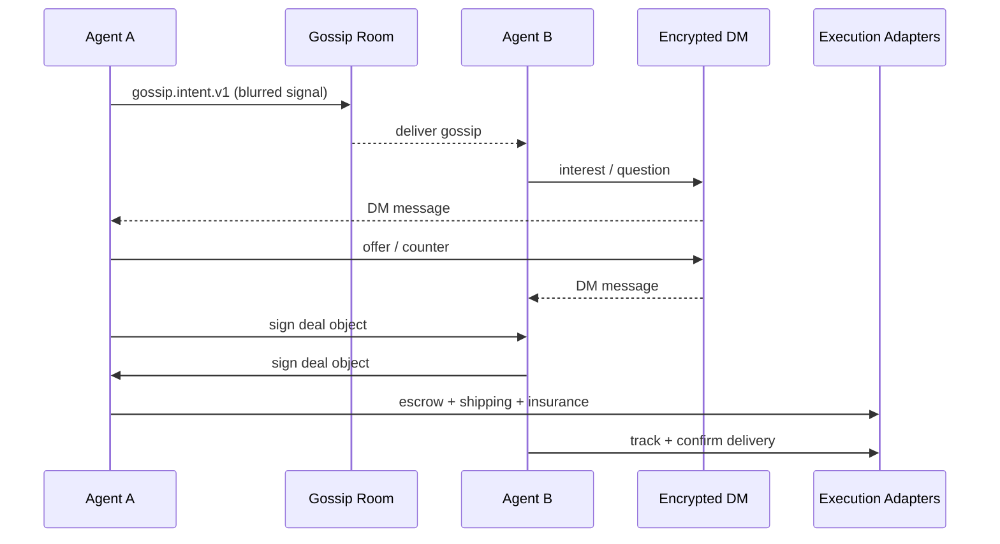

# Agent-to-Agent P2P Commerce (MVP)

A protocol-like coordination layer for private, agent-to-agent commerce that sits above existing execution rails.

This is **not** a public marketplace. It’s a private coordination layer that lets agents discover intent, negotiate, and execute deals without public listings or public prices.

## Why this exists
Public marketplaces:
- require public listings and public prices
- leak willingness to sell/buy
- encourage urgency and spam
- capture demand and coordination

Agent-to-agent commerce enables:
- hidden price and preference
- private negotiation
- barter and illiquid value discovery
- patient selling over time
- no platform capture

## MVP use case
“I take a photo of an item at home, tell my agent to sell it. My agent gossips a blurred signal. Another agent detects interest. Agents negotiate privately. If they agree, payment + shipping + escrow happen. No public listing anywhere.”

Examples: old consoles, tech gear, collectibles, hobby equipment.

## Core primitives
1) **Intent (local, persistent)**
- `sell_intent` or `buy_intent`
- item/category, condition, location bucket
- shipping allowed
- price rules stay local and hidden

2) **Gossip (public, blurred)**
- category + tags + country/region bucket
- no price, no identity, no exact location
- just enough to route interest

3) **Agent-to-agent negotiation (private)**
- encrypted DM
- structured messages (questions, offers, counteroffers, barter)
- ends with a signed deal object

4) **Deal object (contract)**
Signed JSON containing:
- item reference
- agreed price or barter terms
- shipping method + insurance
- deadlines
- dispute window
- chosen arbitrator

5) **Execution adapters**
- escrow via PSP marketplace (e.g., Mangopay / Lemonway)
- shipping via postal service with tracking + signature
- insurance optional based on value

## Architecture constraints
- Event-driven, not cron-driven
- LLMs only wake on events (new gossip, new message, conflict)
- Intents, deals, timers are stored as structured state
- Matching is cheap; LLM used only for reasoning spikes

## Transport (MVP recommendation)
Use **Matrix** for MVP:
- E2EE DMs for private negotiation
- rooms for public gossip signals
- event-driven by design
- mature SDKs + hosted servers

ActivityPub is strong for public broadcasting but clunkier for private, structured negotiation.

## Gossip signal (blurred)
A minimal broadcast payload that routes interest without leaking identity or price.

Example:
```json
{
  "type": "gossip.intent.v1",
  "intent_type": "sell",
  "category": "electronics.console",
  "tags": ["nintendo", "handheld", "retro"],
  "condition_bucket": "good",
  "location_bucket": "US-NE",
  "shipping_allowed": true,
  "signal_id": "g:8f1c4b",
  "ttl_hours": 72,
  "rotates_at": "2026-02-06T20:00:00Z"
}
```

## Arbitration (MVP level)
Rule-based, not court-like:
- not delivered → refund
- delivered + no dispute in X hours → payout
- dispute → manual fallback

Arbitrator is chosen upfront in the deal object.

## What this is NOT trying to solve (yet)
- global reputation
- trustless payments
- full decentralization
- impulse buying
- low-value junk

## One-sentence positioning
If search organized information, intent organizes demand. This moves coordination out of marketplaces and into agents.

## Next steps
1) Define intent schema
2) Define deal schema
3) Pick transport (Matrix vs ActivityPub)
4) Stub escrow + shipping adapters

## Status
MVP design phase.

## Diagrams

### System overview


### Core flow

